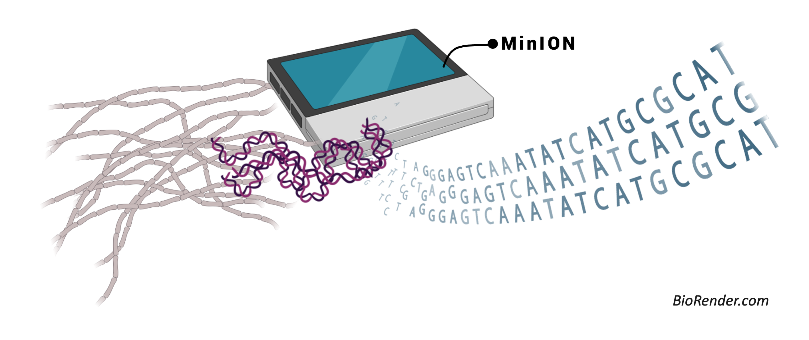
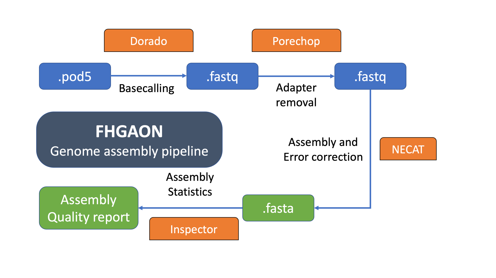

# FHGAON - **Fungal High-quality to Genome Assembly using Oxford Nanopore**



### What is FHGAON?
FHGAON is an easy to use the pipeline for fungal genome sequencing projects to develop whole genome assemblies. It requires little to no coding knowledge about software and dependencies installation on Linux. It has multi-platform support, which is suitable for scientists working on Windows operating system (OS). It employs a docker container to run all the required softwares (Dorado, NECAT, and Inspector), and their dependencies. We tested this pipeline for fungal species having a genome size of about 30-60Mb. 

### Requirements
This pipeline can be run on Linux, Windows, and Mac OS. Download the following based on your operating system.
- Docker Desktop (https://www.docker.com/products/docker-desktop/)
- Python 
- Dorado installation file (https://github.com/nanoporetech/dorado#Installation)
- Windows subsystem for Linux (WSL2) (only for Windows)

### Pipeline workflow


### Features
- Uses highly accurate raw reads (pod5) generated using latest [Ligation Sequencing Kit V14](https://store.nanoporetech.com/us/ligation-sequencing-kit-v14.html)
- Pipeline leverages state-of-the-art tools with the highest performance and accuracy
  - Basecalling raw reads with [Dorado](https://github.com/nanoporetech/dorado)
  - Adapter trimming using [Porechop](https://github.com/rrwick/Porechop)
  - Assembly with [NECAT](https://github.com/xiaochuanle/NECAT)
  - Assembly evaluation with [Inspector](https://github.com/Maggi-Chen/Inspector)
- Easy to use with minimum coding skills
- Multi-platform support using [Docker](https://www.docker.com/products/docker-desktop/)

### Usage
```
usage: fhgaon.py [-h] (-r  | -q ) [-m] [-b] -g  [-t] [-p] [-o OUTPUT]

FHAGON - long read assembly pipeline

options:
  -h, --help            show this help message and exit
  -r , --raw_reads      Path to raw pod5 files
  -q , --fastq          Path to fastq files [Only if basecalling is not
                        required.]
  -g , --genome_size    Estimated size of the genome
  -t , --threads        Number of threads
  -p , --project        Name of the project
  -o , --output         Output directory path

If basecalling is required please provide the following:
  -m , --basecall_model 
                        Basecalling model - Please specify the model based
                        on the sequecing kit.
  -b , --basecall_type 
                        Type of basecalling - simplex (default) or duplex.
```
#### Step I: Clone the github repo to your local machine
```
git clone https://github.com/jtndr011/FHGAON.git
cd FHGAON
```
#### Step II: Copy the raw pod5 files folder or basecalled fastq file to `FHGAON` folder

#### Step III: Building docker container
```
docker build -t fhgaon .
```
if dokcker build gives an error: please try including `--network=host` in the above command.
#### Step IV: Running pipeline
##### If basecalling is not required, run the pipeline as follows
```
docker run -v $(pwd):/app/ fhgaon -q input_file.fastq -g estimated_genome_size -t number_of_threads -p project_name -o output_folder_name
```
Here, `-q` and `-g` flags are required and other flags such as `-t`, `-p`, and `-o` are optional.

##### If basecalling is required, run the pipeline as follows
```
python3 /path/to/fhgaon.py -r pod5/ -m basecalling_model -b basecalling_type | docker run -v $(pwd):/app/ fhgaon -g estimated_genome_size -t number_of_threads -p project_name -o output_folder_name
```
Here, flag `-m` is required (check this link for more information on [basecalling models](https://github.com/nanoporetech/dorado#available-basecalling-models)) and flag `-b` is optional, if not provided the default basecalling type will be simplex.

### Example

**Use Case 1 (With basecalling):** Running pipeline on fungal organisms _Fusarium solani_ with an estimated genome size of 60Mb, sequenced using Ligation Sequencing Kit V14 (with basecalling model - dna_r10.4.1_e8.2_400bps_hac@v4.2.0 (high accuracy) and duplex basecalling with 12 threads.

```
python3 /path/to/fhgaon.py -r pod5/ -m dna_r10.4.1_e8.2_400bps_hac@v4.2.0 -b duplex | docker run -v $(pwd):/app/ fhgaon -g 60000000 -t 12 -p fusarium_solani -o fhgaon_fusarium_asm
```
**Use Case 2 (Basecalling done during the minion sequencing):** Running pipeline on fungal organisms _Fusarium solani_ with an estimated genome size of 60Mb with 12 threads.
```
docker run -v $(pwd):/app/ fhgaon -q input.fastq -g 60000000 -t 12 -p fusarium_solani -o fhgaon_fusarium_asm
```

### Citation
Under process...

